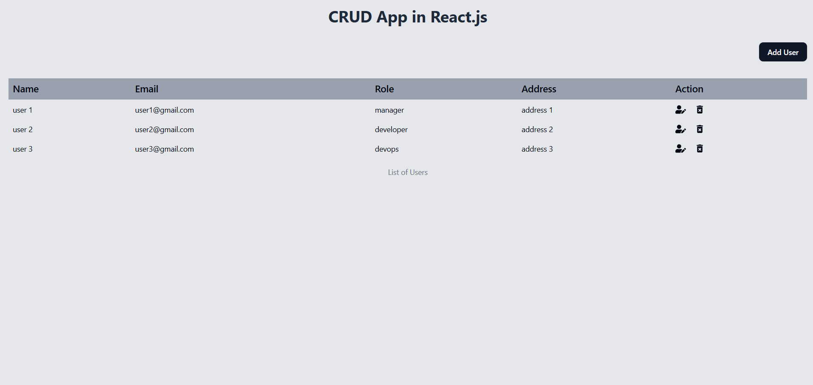
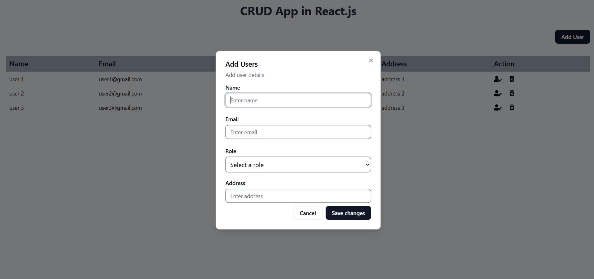

# CRUD React.js Application

A modern, responsive CRUD (Create, Read, Update, Delete) application built with React.js, featuring a clean UI with Tailwind CSS and shadcn/ui components.

## 📱 Screenshots

### Desktop View





## ✨ Features

- **User Management**: Complete CRUD operations for user data
- **Responsive Design**: Optimized for desktop, tablet, and mobile devices
- **Modern UI**: Built with Tailwind CSS and shadcn/ui components
- **Form Validation**: Robust form handling with React Hook Form and Zod
- **Toast Notifications**: User-friendly feedback with Sonner
- **Dialog Modals**: Clean modal interfaces for user interactions
- **Real-time Updates**: Instant UI updates without page refresh

## 🛠️ Tech Stack

- **Frontend Framework**: React.js 19.1.0
- **Build Tool**: Vite 7.0.4
- **Styling**: Tailwind CSS 4.1.11
- **UI Components**: shadcn/ui
- **Form Handling**: React Hook Form 7.62.0
- **Validation**: Zod 4.0.14
- **Icons**: Lucide React & React Icons
- **Notifications**: Sonner 2.0.7
- **Dialog**: Radix UI Dialog

## 🚀 Getting Started

### Prerequisites

- Node.js (version 18 or higher)
- npm or yarn package manager

### Installation

1. **Clone the repository**

   ```bash
   git clone https://github.com/prateek-bka/crud-react-js
   ```

2. **Install dependencies**

   ```bash
   npm install
   ```

3. **Start the development server**

   ```bash
   npm run dev
   ```

4. **Open your browser**
   Navigate to `http://localhost:5173` to view the application

## 📋 Available Scripts

- `npm run dev` - Start development server

## 🏗️ Project Structure

```
crud-react-js/
├── public/
├── src/
│   ├── components/
│   │   ├── ui/           # shadcn/ui components
│   │   ├── AddUser.jsx   # User creation/editing form
│   │   ├── Heading.jsx   # Application header
│   │   └── ListUsers.jsx # User list and management
│   ├── lib/
│   │   └── utils.js      # Utility functions
│   ├── App.jsx           # Main application component
│   └── main.jsx          # Application entry point
├── package.json
└── README.md
```

## 📸 Screenshot Tools

For creating professional screenshots like the ones above, here are popular online tools used by developers:

## 🎯 Core Features

### User Management

- **Create**: Add new users with form validation
- **Read**: Display users in a responsive table
- **Update**: Edit existing user information
- **Delete**: Remove users with confirmation dialog

### User Data Fields

- **Name**: User's full name
- **Email**: Email address
- **Role**: User's role (manager, developer, devops, etc.)
- **Address**: User's address

### UI/UX Features

- **Responsive Design**: Adapts to different screen sizes
- **Interactive Elements**: Hover effects and smooth transitions
- **Confirmation Dialogs**: Safe deletion with user confirmation
- **Toast Notifications**: Success/error feedback
- **Form Validation**: Real-time input validation

## 🎨 Design System

The application uses a consistent design system with:

- **Color Palette**: Gray tones with blue accents
- **Typography**: Clean, readable fonts
- **Spacing**: Consistent padding and margins
- **Components**: Reusable UI components from shadcn/ui

## 📱 Responsive Breakpoints

- **Desktop**: 1024px and above

## 🔧 Configuration

### Tailwind CSS

The project uses Tailwind CSS v4 with custom configuration for optimal styling.

### ESLint

Configured with React-specific rules for code quality and consistency.

## 🤝 Contributing

1. Fork the repository
2. Create a feature branch (`git checkout -b feature/amazing-feature`)
3. Commit your changes (`git commit -m 'Add some amazing feature'`)
4. Push to the branch (`git push origin feature/amazing-feature`)
5. Open a Pull Request

## 📄 License

This project is licensed under the MIT License - see the [LICENSE](LICENSE) file for details.

## 🙏 Acknowledgments

- [shadcn/ui](https://ui.shadcn.com/) for the beautiful UI components
- [Tailwind CSS](https://tailwindcss.com/) for the utility-first CSS framework
- [React Hook Form](https://react-hook-form.com/) for form handling
- [Vite](https://vitejs.dev/) for the fast build tool

## 📞 Support

If you have any questions or need help, please open an issue in the GitHub repository.

---

**Made with ❤️ using React.js by Prateek Agrawal**
